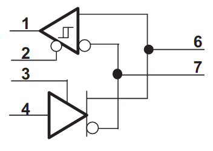

# RS485 library for Mongoose OS

This is a library for transmitting and receiving data via an RS485 port.

## Usage

See [rs485.h.md](wiki/rs485.h) for more extensive documentation

Setting up RS485 port:

    struct rs485_port rs485;
    rs485.rxPin = RS485_RX;             // The GPIO pin to receive data through
    rs485.txPin = RS485_TX;             // The GPIO pin to transmit data through
    rs485.directionPin = RS485_DIR;     // The pin that will determine data direction
    rs485.uartNumber = RS485_UART_NUM   // The UART number to use (must be between 0 and 2)
    rs485_begin(rs485, RS485_BAUD);

Writing data to RS485 port:

    rs485_write(rs485, "Hello World", 11 /* Number of bytes to transmit */);

Reading from RS485 port:

    // Library can currently only read one byte at a time
    // To read an entire string, add bytes to a buffer

    char buffer[255];
    int i = 0;
    while(rs485_available(rs485) == 0){
        uint8_t b = rs485_read_byte(rs485);
        buffer[i++] = b;
    }

## Connecting the chip

The library works with any RS485 chip that has a schematic similar to the following illustration:

| GPIO | Chip pin | Description |
| - | -: | - |
| UART RX pin | 1 | Data received via the RS485 port is transmitted on this pin |
| Direction pin | 2 | Chip will receive data when this pin in low |
| Direction pin | 3 | Chip will transmit data when this pin is high |
| UART TX pin | 4 | Data received on this pin will be transmitted on the RS485 port |